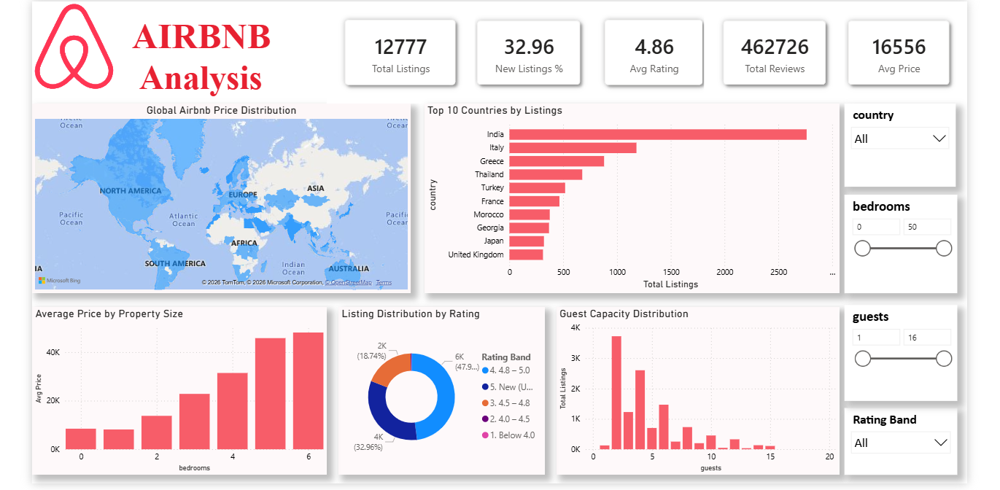

# Airbnb Listings Analysis

This project focuses on Exploratory Data Analysis (EDA) and Interactive Dashboard Development using Airbnb listing data.

## Project Overview
- Performed data cleaning and preprocessing.
- Conducted Exploratory Data Analysis (EDA) using Python.
- Identified patterns in pricing, ratings, reviews, guest capacity, and property size.
- Built an interactive Power BI dashboard to visualize key business insights.

## Tools Used
- Python
- Pandas
- NumPy
- Matplotlib
- Seaborn
- Power BI

## Dashboard Highlights
- Total Listings
- Average Price
- Average Rating
- Total Reviews
- New Listings Percentage
- Country-wise Listing Distribution
- Property Size vs Price Analysis
- Rating Distribution
- Guest Capacity Analysis

## Key Insights
- Most listings have high ratings.
- Around 33% of listings are unrated.
- Larger properties generally have higher prices.
- Most listings are suitable for small groups of guests.
- Listing distribution varies significantly across countries.

## Project Components
- EDA Notebook
- Cleaned Dataset
- Power BI Dashboard
- Insights & Recommendations

## Dashboard Preview

